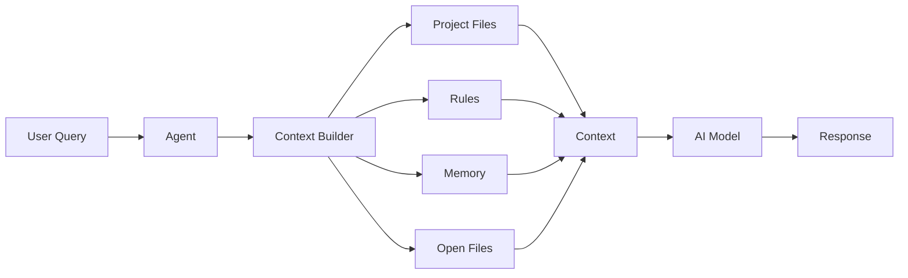
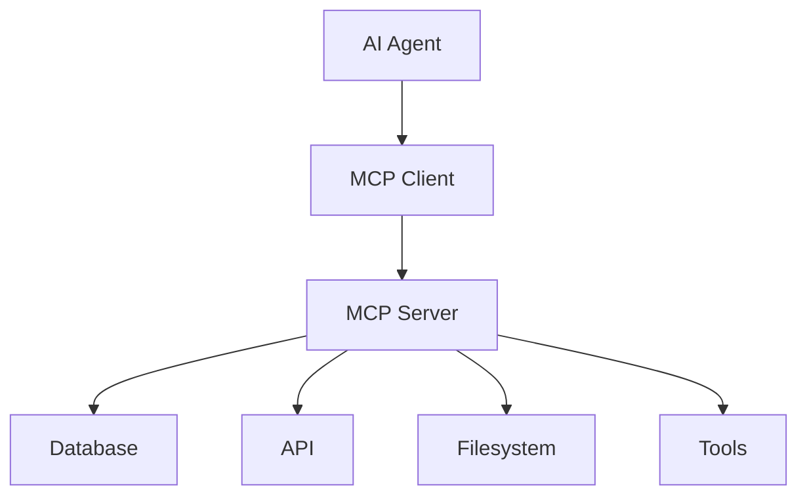
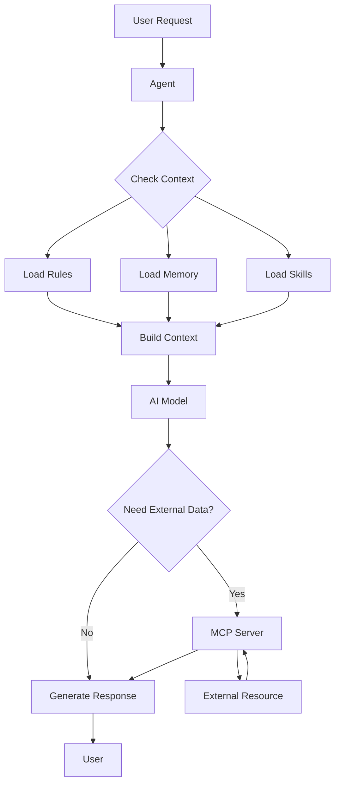

# Правила, команди та навички
# для Agentic IDE

Ефективне використання Cursor IDE

<div class="pt-12">
  <span @click="$slidev.nav.next" class="px-2 py-1 rounded cursor-pointer" hover="bg-white bg-opacity-10">
    Почнемо <carbon:arrow-right class="inline"/>
  </span>
</div>

---
layout: default
---

# Що таке Agentic IDE?

<div class="grid grid-cols-2 gap-4 mt-8">

<div>

## 🤖 AI-Асистент
- Розуміє контекст проєкту
- Виконує складні завдання
- Навчається з досвіду

</div>

<div>

## 🛠️ Інструменти керування
- **Rules** - правила поведінки
- **Commands** - автоматизація
- **Skills** - розширення можливостей

</div>

</div>

<div class="mt-8 text-sm opacity-60">
Cursor IDE - приклад сучасного Agentic IDE
</div>

---
layout: center
class: text-center
---

# Зміст

<div class="grid grid-cols-2 gap-6 mt-8 text-left">

<div>

## Фундаментальні концепції
- Agent Context
- Agent Memory

## Інструменти керування
- Rules
- Commands
- Skills

</div>

<div>

## Інтеграція
- MCP Protocol

## Практика
- Use Cases
- Best Practices
- Troubleshooting

</div>

</div>

---
layout: section
---

# Agent Context

---
layout: two-cols
layoutClass: gap-8
---

# Agent Context

## Що це?

**Контекст** - це вся інформація, доступна агенту для прийняття рішень та виконання завдань.

<div class="mt-4">

### Ключові аспекти:
- Поточний стан проєкту
- Історія взаємодій
- Налаштування та правила
- Відкриті файли та код

</div>

::right::

## Джерела контексту

<div class="space-y-4 mt-4">

**📁 Файли проєкту**
- Відкриті файли
- Структура проєкту
- Історія змін

**📋 Rules**
- Project Rules
- User Rules
- Team Rules

**💾 Memory**
- Попередні сесії
- Збережені налаштування

</div>

---
layout: default
---

# Agent Context: Як працює

<div class="mt-6">



</div>

<div class="mt-6 text-sm">

**Контекст формується динамічно** на основі поточного стану проєкту та історії взаємодій

</div>

---
layout: section
---

# Agent Memory

---
layout: two-cols
layoutClass: gap-8
---

# Agent Memory

## Типи пам'яті

<div class="space-y-4 mt-4">

### 🧠 Короткострокова
- Поточна сесія чату
- Відкриті файли
- Активні команди

### 💾 Довгострокова
- Попередні сесії
- Збережені налаштування
- Історія взаємодій

</div>

::right::

## Переваги

<div class="space-y-3 mt-4">

✅ **Контекстуальність**
- Агент пам'ятає попередні розмови

✅ **Персоналізація**
- Адаптація до стилю роботи

✅ **Ефективність**
- Менше повторень інформації

✅ **Навчання**
- Покращення з часом

</div>

---
layout: default
---

# Agent Memory: Практичні приклади

<div class="grid grid-cols-2 gap-6 mt-6">

<div>

## Приклад 1: Контекст проєкту

Агент пам'ятає:
- Структуру проєкту
- Використовувані технології
- Стиль коду команди

</div>

<div>

## Приклад 2: Історія змін

Агент відстежує:
- Останні зміни в коді
- Обговорені проблеми
- Прийняті рішення

</div>

</div>

<div class="mt-6 p-4 bg-blue-500/10 rounded">

💡 **Важливо**: Пам'ять покращує якість відповідей агента, але не завжди активна між сесіями

</div>

---
layout: section
---

# Rules

Правила поведінки агента

---
layout: center
class: text-center
---

# Rules: Огляд

<div class="grid grid-cols-3 gap-6 mt-8">

<div>

## Що це?

Інструкції, які визначають поведінку агента

</div>

<div>

## Навіщо?

- Стандартизація коду
- Автоматизація workflow
- Керування якістю

</div>

<div>

## Як працює?

Правила додаються до контексту агента перед генерацією відповіді

</div>

</div>

---
layout: two-cols
layoutClass: gap-8
---

# Типи правил

<div class="space-y-4 mt-4">

## 📁 Project Rules
`.cursor/rules/`
- Версійний контроль
- Специфічні для проєкту
- Командна робота

## 👤 User Rules
Глобальні налаштування
- Особисті уподобання
- Усі проєкти
- Стиль роботи

</div>

::right::

<div class="space-y-4 mt-4">

## 👥 Team Rules
Dashboard управління
- Організаційні стандарти
- Обов'язкові правила
- Централізоване керування

## 📝 AGENTS.md
Простий markdown файл
- Альтернатива `.cursor/rules`
- В корені проєкту
- Без метаданих

</div>

---
layout: default
---

# Структура правил

<div class="mt-4">

```markdown
---
description: "Стандарти для React компонентів"
globs: ["**/*.tsx", "**/*.jsx"]
alwaysApply: false
---

## React Components

- Використовувати функціональні компоненти
- Props через TypeScript інтерфейси
- Tailwind для стилізації

@component-template.tsx
```

</div>

<div class="grid grid-cols-2 gap-4 mt-6">

<div>

### Frontmatter поля:
- `description` - опис правила
- `globs` - паттерни файлів
- `alwaysApply` - завжди застосовувати

</div>

<div>

### Типи застосування:
- **Always Apply** - завжди
- **Apply Intelligently** - коли релевантно
- **Apply to Specific Files** - за globs
- **Apply Manually** - через @mention

</div>

</div>

---
layout: default
---

# Приклади правил

<div class="grid grid-cols-2 gap-6 mt-4">

<div>

## Стиль коду

```markdown
---
description: "TypeScript стиль"
alwaysApply: true
---

- Використовувати camelCase
- Експортувати типи
- Додавати JSDoc коментарі
```

</div>

<div>

## Архітектура

```markdown
---
description: "API структура"
globs: ["**/api/**"]
---

- Використовувати Zod для валідації
- Експортувати типи зі схем
- Обробка помилок через middleware
```

</div>

</div>

<div class="mt-6 p-4 bg-green-500/10 rounded">

✅ **Best Practice**: Зберігайте правила короткими (< 500 рядків) та фокусованими

</div>

---
layout: default
---

# Rules: Best Practices

<div class="grid grid-cols-2 gap-6 mt-4">

<div>

## ✅ Робіть

- Чіткі та конкретні інструкції
- Посилання на файли через `@filename`
- Розбивайте великі правила
- Версійний контроль правил

</div>

<div>

## ❌ Уникайте

- Копіювання всього коду
- Дублювання лінтерів
- Занадто складні правила
- Суперечливі інструкції

</div>

</div>

<div class="mt-6">

```markdown
# ❌ Погано
Копіювання всього style guide (5000+ рядків)

# ✅ Добре
Посилання на файл з прикладами
@style-guide.md
```

</div>

---
layout: section
---

# Commands

Автоматизація завдань

---
layout: two-cols
layoutClass: gap-8
---

# Commands

## Що це?

**Команди** - це переіспользовувані інструкції для агента, які можна викликати за назвою.

<div class="mt-4 space-y-3">

### Призначення:
- Автоматизація рутинних завдань
- Стандартизація workflow
- Швидкий доступ до складних операцій

</div>

::right::

## Створення команди

<div class="mt-4">

```markdown
---
name: "Створити React компонент"
description: "Генерує новий компонент з TypeScript"
---

Створи React компонент з:
- TypeScript інтерфейсом для props
- Tailwind стилями
- Експортом за замовчуванням

Використай шаблон з @component-template.tsx
```

</div>

---
layout: default
---

# Commands: Приклади

<div class="grid grid-cols-2 gap-6 mt-4">

<div>

## Створення API endpoint

```markdown
---
name: "Новий API endpoint"
---

Створи Express endpoint:
1. Валідація через Zod
2. Обробка помилок
3. Логування запитів
4. Типи TypeScript

@api-template.ts
```

</div>

<div>

## Рефакторинг коду

```markdown
---
name: "Рефакторинг функції"
---

Рефактори функцію з урахуванням:
- SOLID принципів
- Тестованості
- Читабельності
- Документації
```

</div>

</div>

<div class="mt-6 p-4 bg-blue-500/10 rounded">

💡 Команди можна викликати через `@command-name` в чаті

</div>

---
layout: default
---

# Commands: Best Practices

<div class="grid grid-cols-2 gap-6 mt-4">

<div>

## ✅ Робіть

- Описові назви команд
- Чіткі інструкції
- Посилання на шаблони
- Тестування команд

</div>

<div>

## ❌ Уникайте

- Занадто загальні команди
- Дублювання функціональності
- Нечіткі інструкції
- Залежності між командами

</div>

</div>

<div class="mt-6">

**Приклад інтеграції з Rules:**

```markdown
# Command використовує Rule
@api-guidelines
@create-endpoint-command
```

</div>

---
layout: section
---

# Skills

Розширення можливостей

---
layout: two-cols
layoutClass: gap-8
---

# Skills

## Що це?

**Skills** - це стандартизовані набори можливостей для агентів, що розширюють їх функціональність.

<div class="mt-4 space-y-3">

### Відмінності від Rules:
- **Skills** - готові рішення
- **Rules** - кастомні інструкції
- **Skills** - імпортуються
- **Rules** - створюються локально

</div>

::right::

## Agent Skills

<div class="mt-4 space-y-3">

### Стандарт:
- Відкритий формат
- Спільнота розробників
- Переіспользовуваність

### Використання:
1. Увімкнути в налаштуваннях
2. Agent вирішує коли застосувати
3. Автоматична інтеграція

</div>

---
layout: default
---

# Skills: Приклади

<div class="grid grid-cols-2 gap-6 mt-4">

<div>

## Database Skills
- Генерація SQL запитів
- Оптимізація запитів
- Міграції БД

</div>

<div>

## Testing Skills
- Генерація тестів
- Покриття коду
- E2E тестування

</div>

<div>

## Security Skills
- Аналіз вразливостей
- Безпека API
- Аудит коду

</div>

<div>

## Documentation Skills
- Генерація документації
- API docs
- README файли

</div>

</div>

<div class="mt-6 p-4 bg-green-500/10 rounded">

✅ Skills завжди застосовуються інтелектуально - Agent вирішує коли вони релевантні

</div>

---
layout: section
---

# MCP

Model Context Protocol

---
layout: two-cols
layoutClass: gap-8
---

# MCP: Що це?

**Model Context Protocol** - стандартизований протокол для підключення AI-агентів до зовнішніх інструментів та джерел даних.

<div class="mt-4 space-y-3">

### Призначення:
- Безпечна інтеграція
- Стандартизований API
- Розширення можливостей
- Доступ до даних

</div>

::right::

## Архітектура

<div class="mt-4">



</div>

<div class="mt-4 text-sm">

**MCP Server** - мост між агентом та зовнішніми ресурсами

</div>

---
layout: default
---

# MCP: Використання

<div class="grid grid-cols-2 gap-6 mt-4">

<div>

## Приклади інтеграцій

**База даних:**
- Читання/запис даних
- Виконання запитів
- Міграції

**API сервіси:**
- HTTP запити
- Аутентифікація
- Обробка відповідей

</div>

<div>

## Безпека

**Контроль доступу:**
- Дозволи на ресурси
- Валідація запитів
- Логування дій

**Best Practices:**
- Мінімальні права
- Валідація даних
- Обмеження доступу

</div>

</div>

<div class="mt-6 p-4 bg-yellow-500/10 rounded">

⚠️ MCP надає потужні можливості - використовуйте обережно та з належними обмеженнями

</div>

---
layout: section
---

# Практичні Use Cases

---
layout: default
---

# Workflow: Як все працює разом

<div class="mt-4">



</div>

<div class="mt-6 grid grid-cols-2 gap-4">

<div>

### Типовий сценарій:
1. Користувач запитує створення API
2. Agent завантажує Rules для API
3. Використовує Skills для генерації
4. Через MCP отримує дані з БД
5. Генерує код згідно правил

</div>

<div>

### Результат:
- Стандартизований код
- Інтеграція з БД
- Документація
- Тести

</div>

</div>

---
layout: default
---

# Use Cases

<div class="grid grid-cols-2 gap-6 mt-4">

<div>

## 🏗️ Створення проєкту

**Rules:** Стандарти архітектури
**Commands:** Ініціалізація проєкту
**Skills:** Генерація структури
**MCP:** Шаблони з репозиторію

</div>

<div>

## 🔄 Рефакторинг

**Rules:** Стиль коду
**Memory:** Попередні зміни
**Commands:** Автоматичний рефакторинг
**Skills:** Аналіз коду

</div>

<div>

## 🐛 Виправлення помилок

**Memory:** Історія проблем
**Skills:** Діагностика
**MCP:** Логи та метрики
**Rules:** Стандарти обробки

</div>

<div>

## 📚 Документація

**Rules:** Формат документації
**Commands:** Генерація docs
**Skills:** API документація
**MCP:** Експорт в різні формати

</div>

</div>

---
layout: section
---

# Best Practices

---
layout: default
---

# Best Practices: Загальні рекомендації

<div class="grid grid-cols-2 gap-6 mt-4">

<div>

## ✅ Робіть

### Організація:
- Розбивайте великі правила
- Використовуйте папки для правил
- Версійний контроль
- Документуйте правила

### Контент:
- Посилання на файли
- Конкретні приклади
- Оновлюйте регулярно
- Тестуйте правила

</div>

<div>

## ❌ Уникайте

### Структура:
- Занадто довгі правила
- Дублювання інструкцій
- Конфліктуючі правила
- Застарілі правила

### Контент:
- Копіювання коду
- Дублювання лінтерів
- Нечіткі інструкції
- Занадто загальні правила

</div>

</div>

---
layout: default
---

# Best Practices: По компонентах

<div class="space-y-4 mt-4">

## Rules
- ✅ Фокусовані правила (< 500 рядків)
- ✅ Використовуйте `@filename` для посилань
- ❌ Не копіюйте весь style guide

## Commands
- ✅ Описові назви
- ✅ Чіткі інструкції
- ❌ Не створюйте занадто загальні команди

## Skills
- ✅ Довіряйте Agent вирішенню
- ✅ Оновлюйте регулярно
- ❌ Не дублюйте функціональність правил

## MCP
- ✅ Мінімальні права доступу
- ✅ Валідація даних
- ❌ Не надавайте повний доступ

</div>

---
layout: section
---

# Troubleshooting

---
layout: default
---

# Типові проблеми та рішення

<div class="space-y-6 mt-4">

<div>

## Правило не застосовується

**Проблема:** Rule не спрацьовує

**Рішення:**
- Перевірте `globs` паттерни
- Переконайтесь що `description` вказано
- Спробуйте `@rule-name` вручну
- Перевірте конфлікти з іншими правилами

</div>

<div>

## Команда не працює

**Проблема:** Command не виконується правильно

**Рішення:**
- Перевірте чіткість інструкцій
- Додайте більше контексту
- Використайте посилання на файли
- Перевірте залежності

</div>

<div>

## Конфлікти правил

**Проблема:** Правила суперечать одне одному

**Рішення:**
- Перевірте порядок застосування (Team → Project → User)
- Уточніть scope правил через `globs`
- Видаліть дублювання
- Об'єднайте схожі правила

</div>

</div>

---
layout: center
class: text-center
---

# Висновки

<div class="grid grid-cols-2 gap-8 mt-8 text-left">

<div>

## Ключові моменти

- **Context** - основа роботи агента
- **Memory** - покращує якість
- **Rules** - стандартизація
- **Commands** - автоматизація

</div>

<div>

## Рекомендації

- Почніть з простих правил
- Поступово розширюйте
- Тестуйте та оновлюйте
- Діліться з командою

</div>

</div>

---
layout: center
class: text-center
---

# Ресурси

<div class="grid grid-cols-2 gap-6 mt-8 text-left">

<div>

## Документація

- [Rules](https://cursor.com/docs/context/rules)
- [Commands](https://cursor.com/docs/context/commands)
- [Skills](https://cursor.com/docs/context/skills)

</div>

<div>

## Корисні посилання

- [Slidev](https://sli.dev/)
- [Cursor IDE](https://cursor.com/)
- [MCP Protocol](https://modelcontextprotocol.io/)

</div>

</div>

---
layout: center
class: text-center
---

# Дякую за увагу!

<div class="mt-8">

Питання?

</div>

<div class="mt-12 text-sm opacity-60">

Презентація створена за допомогою Slidev

</div>
