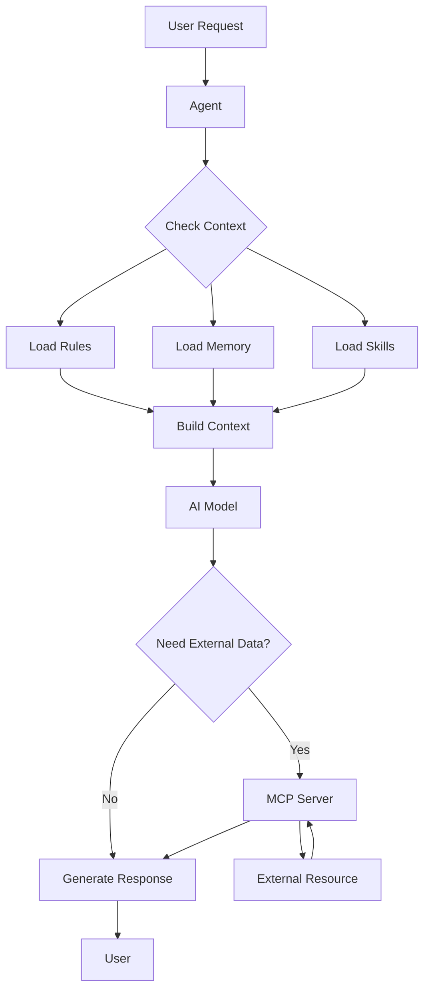

<style>
.slidev-layout {
  background: linear-gradient(135deg, #667eea 0%, #764ba2 100%);
}
</style>

<div class="absolute inset-0 bg-gradient-to-br from-blue-600 via-purple-600 to-pink-600 opacity-90"></div>

<div class="relative z-10">
  <h1 v-motion-slide-top class="text-6xl font-bold mb-4 bg-gradient-to-r from-white to-blue-100 bg-clip-text text-transparent">
    Правила, команди та навички
  </h1>
  <h2 v-motion-slide-top :delay="100" class="text-4xl font-semibold mb-8 bg-gradient-to-r from-blue-100 to-purple-100 bg-clip-text text-transparent">
    для Agentic IDE
  </h2>

  <p v-motion-fade :delay="200" class="text-xl text-white/90 mb-12">
    Ефективне використання Cursor IDE
  </p>

  <div v-motion-fade :delay="300" class="pt-12">
    <span @click="$slidev.nav.next" class="px-6 py-3 rounded-full cursor-pointer bg-white/20 backdrop-blur-md border border-white/30 hover:bg-white/30 transition-all duration-300 shadow-lg hover:shadow-xl text-white font-semibold inline-flex items-center gap-2">
      Почнемо <carbon:arrow-right class="inline text-xl"/>
    </span>
  </div>
</div>

---
layout: default
class: text-center
background: linear-gradient(135deg, #667eea 0%, #764ba2 50%, #f093fb 100%)
---

<style>
.slidev-page {
  background: linear-gradient(135deg, #667eea 0%, #764ba2 50%, #f093fb 100%);
}
</style>

<div class="relative z-10">
  <h1 v-motion-slide-top class="text-5xl font-bold mb-12 text-white">
    Що таке Agentic IDE?
  </h1>

  <div class="grid grid-cols-2 gap-8 mt-8">
    <div v-motion-slide-left class="p-6 rounded-2xl bg-white/10 backdrop-blur-md border border-white/20 shadow-xl">
      <h2 class="text-3xl font-bold mb-4 text-white">🤖 AI-Асистент</h2>
      <ul class="text-left space-y-2 text-white/90">
        <li v-click>Розуміє контекст проєкту</li>
        <li v-click>Виконує складні завдання</li>
        <li v-click>Навчається з досвіду</li>
      </ul>
    </div>

    <div v-motion-slide-right class="p-6 rounded-2xl bg-white/10 backdrop-blur-md border border-white/20 shadow-xl">
      <h2 class="text-3xl font-bold mb-4 text-white">🛠️ Інструменти керування</h2>
      <ul class="text-left space-y-2 text-white/90">
        <li v-click><strong>Rules</strong> - правила поведінки</li>
        <li v-click><strong>Commands</strong> - автоматизація</li>
        <li v-click><strong>Skills</strong> - розширення можливостей</li>
      </ul>
    </div>
  </div>

  <div v-motion-fade :delay="400" class="mt-8 text-lg text-white/80 bg-white/10 backdrop-blur-sm px-4 py-2 rounded-full inline-block">
    Cursor IDE - приклад сучасного Agentic IDE
  </div>
</div>

---
layout: center
class: text-center
background: linear-gradient(135deg, #1e3c72 0%, #2a5298 100%)
---

<style>
.slidev-page {
  background: linear-gradient(135deg, #1e3c72 0%, #2a5298 100%);
}
</style>

<div class="relative z-10">
  <h1 v-motion-slide-top class="text-6xl font-bold mb-12 text-white">
    Зміст
  </h1>

  <div class="grid grid-cols-2 gap-8 mt-8 text-left">
    <div v-motion-slide-left class="p-6 rounded-2xl bg-white/10 backdrop-blur-md border border-white/20 shadow-xl">
      <h2 v-click class="text-2xl font-bold mb-4 text-white">Фундаментальні концепції</h2>
      <ul class="space-y-2 text-white/90">
        <li v-click>Agent Context</li>
        <li v-click>Agent Memory</li>
      </ul>

      <h2 v-click class="text-2xl font-bold mb-4 mt-6 text-white">Інструменти керування</h2>
      <ul class="space-y-2 text-white/90">
        <li v-click>Rules</li>
        <li v-click>Commands</li>
        <li v-click>Skills</li>
      </ul>
    </div>

    <div v-motion-slide-right class="p-6 rounded-2xl bg-white/10 backdrop-blur-md border border-white/20 shadow-xl">
      <h2 v-click class="text-2xl font-bold mb-4 text-white">Інтеграція</h2>
      <ul class="space-y-2 text-white/90">
        <li v-click>MCP Protocol</li>
      </ul>

      <h2 v-click class="text-2xl font-bold mb-4 mt-6 text-white">Практика</h2>
      <ul class="space-y-2 text-white/90">
        <li v-click>Use Cases</li>
        <li v-click>Best Practices</li>
        <li v-click>Troubleshooting</li>
      </ul>
    </div>
  </div>
</div>

---
layout: section
background: linear-gradient(135deg, #667eea 0%, #764ba2 100%)
transition: fade
---

<style>
.slidev-page {
  background: linear-gradient(135deg, #667eea 0%, #764ba2 100%);
}
</style>

<h1 v-motion-slide-top class="text-6xl font-bold text-white">
  Agent Context
</h1>

---
layout: two-cols
layoutClass: gap-8
background: linear-gradient(135deg, #667eea 0%, #764ba2 100%)
---

<style>
.slidev-page {
  background: linear-gradient(135deg, #667eea 0%, #764ba2 100%);
}
</style>

<div class="relative z-10">
  <h1 v-motion-slide-top class="text-5xl font-bold mb-6 text-white">Agent Context</h1>

  <div v-motion-slide-left>
    <h2 class="text-3xl font-semibold mb-4 text-white">Що це?</h2>
    <p class="text-lg text-white/90 mb-6">
      <strong>Контекст</strong> - це вся інформація, доступна агенту для прийняття рішень та виконання завдань.
    </p>

    <div class="mt-4 p-4 rounded-xl bg-white/10 backdrop-blur-md border border-white/20">
      <h3 class="text-xl font-semibold mb-3 text-white">Ключові аспекти:</h3>
      <ul class="space-y-2 text-white/90">
        <li v-click>Поточний стан проєкту</li>
        <li v-click>Історія взаємодій</li>
        <li v-click>Налаштування та правила</li>
        <li v-click>Відкриті файли та код</li>
      </ul>
    </div>
  </div>
</div>

::right::

<div class="relative z-10">
  <div v-motion-slide-right>
    <h2 class="text-3xl font-semibold mb-6 text-white">Джерела контексту</h2>

    <div class="space-y-4">
      <div v-click class="p-4 rounded-xl bg-white/10 backdrop-blur-md border border-white/20">
        <h3 class="text-xl font-semibold mb-2 text-white">📁 Файли проєкту</h3>
        <ul class="space-y-1 text-white/90 text-sm">
          <li>Відкриті файли</li>
          <li>Структура проєкту</li>
          <li>Історія змін</li>
        </ul>
      </div>

      <div v-click class="p-4 rounded-xl bg-white/10 backdrop-blur-md border border-white/20">
        <h3 class="text-xl font-semibold mb-2 text-white">📋 Rules</h3>
        <ul class="space-y-1 text-white/90 text-sm">
          <li>Project Rules</li>
          <li>User Rules</li>
          <li>Team Rules</li>
        </ul>
      </div>

      <div v-click class="p-4 rounded-xl bg-white/10 backdrop-blur-md border border-white/20">
        <h3 class="text-xl font-semibold mb-2 text-white">💾 Memory</h3>
        <ul class="space-y-1 text-white/90 text-sm">
          <li>Попередні сесії</li>
          <li>Збережені налаштування</li>
        </ul>
      </div>
    </div>
  </div>
</div>

---
layout: default
background: linear-gradient(135deg, #667eea 0%, #764ba2 100%)
---

<style>
.slidev-page {
  background: linear-gradient(135deg, #667eea 0%, #764ba2 100%);
}
</style>

<div class="relative z-10">
  <h1 v-motion-slide-top class="text-5xl font-bold mb-8 text-white text-center">
    Agent Context: Як працює
  </h1>

  <div v-motion-fade :delay="100" class="mt-6 p-6 rounded-2xl bg-white/10 backdrop-blur-md border border-white/20 shadow-xl">
    ```mermaid
    graph LR
        A[User Query] --> B[Agent]
        B --> C[Context Builder]
        C --> D[Project Files]
        C --> E[Rules]
        C --> F[Memory]
        C --> G[Open Files]
        D --> H[Context]
        E --> H
        F --> H
        G --> H
        H --> I[AI Model]
        I --> J[Response]
    ```
  </div>

  <div v-motion-fade :delay="200" class="mt-6 p-4 rounded-xl bg-white/10 backdrop-blur-sm border border-white/20 text-center">
    <p class="text-lg text-white/90">
      <strong>Контекст формується динамічно</strong> на основі поточного стану проєкту та історії взаємодій
    </p>
  </div>
</div>

---
layout: section
background: linear-gradient(135deg, #f093fb 0%, #f5576c 100%)
transition: fade
---

<style>
.slidev-page {
  background: linear-gradient(135deg, #f093fb 0%, #f5576c 100%);
}
</style>

<h1 v-motion-slide-top class="text-6xl font-bold text-white">
  Agent Memory
</h1>

---
layout: two-cols
layoutClass: gap-8
background: linear-gradient(135deg, #f093fb 0%, #f5576c 100%)
---

<style>
.slidev-page {
  background: linear-gradient(135deg, #f093fb 0%, #f5576c 100%);
}
</style>

<div class="relative z-10">
  <h1 v-motion-slide-top class="text-5xl font-bold mb-6 text-white">Agent Memory</h1>

  <div v-motion-slide-left>
    <h2 class="text-3xl font-semibold mb-6 text-white">Типи пам'яті</h2>

    <div class="space-y-4">
      <div v-click class="p-5 rounded-xl bg-white/10 backdrop-blur-md border border-white/20 shadow-lg">
        <h3 class="text-2xl font-semibold mb-3 text-white">🧠 Короткострокова</h3>
        <ul class="space-y-2 text-white/90">
          <li>Поточна сесія чату</li>
          <li>Відкриті файли</li>
          <li>Активні команди</li>
        </ul>
      </div>

      <div v-click class="p-5 rounded-xl bg-white/10 backdrop-blur-md border border-white/20 shadow-lg">
        <h3 class="text-2xl font-semibold mb-3 text-white">💾 Довгострокова</h3>
        <ul class="space-y-2 text-white/90">
          <li>Попередні сесії</li>
          <li>Збережені налаштування</li>
          <li>Історія взаємодій</li>
        </ul>
      </div>
    </div>
  </div>
</div>

::right::

<div class="relative z-10">
  <div v-motion-slide-right>
    <h2 class="text-3xl font-semibold mb-6 text-white">Переваги</h2>

    <div class="space-y-4">
      <div v-click class="p-4 rounded-xl bg-white/10 backdrop-blur-md border border-white/20 shadow-lg">
        <h3 class="text-xl font-semibold mb-2 text-white">✅ Контекстуальність</h3>
        <p class="text-white/90 text-sm">Агент пам'ятає попередні розмови</p>
      </div>

      <div v-click class="p-4 rounded-xl bg-white/10 backdrop-blur-md border border-white/20 shadow-lg">
        <h3 class="text-xl font-semibold mb-2 text-white">✅ Персоналізація</h3>
        <p class="text-white/90 text-sm">Адаптація до стилю роботи</p>
      </div>

      <div v-click class="p-4 rounded-xl bg-white/10 backdrop-blur-md border border-white/20 shadow-lg">
        <h3 class="text-xl font-semibold mb-2 text-white">✅ Ефективність</h3>
        <p class="text-white/90 text-sm">Менше повторень інформації</p>
      </div>

      <div v-click class="p-4 rounded-xl bg-white/10 backdrop-blur-md border border-white/20 shadow-lg">
        <h3 class="text-xl font-semibold mb-2 text-white">✅ Навчання</h3>
        <p class="text-white/90 text-sm">Покращення з часом</p>
      </div>
    </div>
  </div>
</div>

---
layout: default
background: linear-gradient(135deg, #f093fb 0%, #f5576c 100%)
---

<style>
.slidev-page {
  background: linear-gradient(135deg, #f093fb 0%, #f5576c 100%);
}
</style>

<div class="relative z-10">
  <h1 v-motion-slide-top class="text-5xl font-bold mb-8 text-white text-center">
    Agent Memory: Практичні приклади
  </h1>

  <div class="grid grid-cols-2 gap-6 mt-6">
    <div v-motion-slide-left v-click class="p-6 rounded-xl bg-white/10 backdrop-blur-md border border-white/20 shadow-xl">
      <h2 class="text-2xl font-bold mb-4 text-white">Приклад 1: Контекст проєкту</h2>
      <p class="text-white/90 mb-3">Агент пам'ятає:</p>
      <ul class="space-y-2 text-white/90">
        <li>Структуру проєкту</li>
        <li>Використовувані технології</li>
        <li>Стиль коду команди</li>
      </ul>
    </div>

    <div v-motion-slide-right v-click class="p-6 rounded-xl bg-white/10 backdrop-blur-md border border-white/20 shadow-xl">
      <h2 class="text-2xl font-bold mb-4 text-white">Приклад 2: Історія змін</h2>
      <p class="text-white/90 mb-3">Агент відстежує:</p>
      <ul class="space-y-2 text-white/90">
        <li>Останні зміни в коді</li>
        <li>Обговорені проблеми</li>
        <li>Прийняті рішення</li>
      </ul>
    </div>
  </div>

  <div v-motion-fade :delay="300" class="mt-6 p-5 rounded-xl bg-blue-500/20 backdrop-blur-md border border-blue-400/30 shadow-lg text-center">
    <p class="text-lg text-white">
      💡 <strong>Важливо</strong>: Пам'ять покращує якість відповідей агента, але не завжди активна між сесіями
    </p>
  </div>
</div>

---
layout: section
background: linear-gradient(135deg, #4facfe 0%, #00f2fe 100%)
transition: fade
---

<style>
.slidev-page {
  background: linear-gradient(135deg, #4facfe 0%, #00f2fe 100%);
}
</style>

<h1 v-motion-slide-top class="text-6xl font-bold text-white mb-4">
  Rules
</h1>
<p v-motion-fade :delay="100" class="text-2xl text-white/90">
  Правила поведінки агента
</p>

---
layout: center
class: text-center
background: linear-gradient(135deg, #4facfe 0%, #00f2fe 100%)
---

<style>
.slidev-page {
  background: linear-gradient(135deg, #4facfe 0%, #00f2fe 100%);
}
</style>

<div class="relative z-10">
  <h1 v-motion-slide-top class="text-6xl font-bold mb-12 text-white">
    Rules: Огляд
  </h1>

  <div class="grid grid-cols-3 gap-6 mt-8">
    <div v-motion-slide-left class="p-6 rounded-2xl bg-white/10 backdrop-blur-md border border-white/20 shadow-xl">
      <h2 v-click class="text-2xl font-bold mb-4 text-white">Що це?</h2>
      <p v-click class="text-white/90">Інструкції, які визначають поведінку агента</p>
    </div>

    <div v-motion-fade :delay="100" class="p-6 rounded-2xl bg-white/10 backdrop-blur-md border border-white/20 shadow-xl">
      <h2 v-click class="text-2xl font-bold mb-4 text-white">Навіщо?</h2>
      <ul class="text-left space-y-2 text-white/90">
        <li v-click>Стандартизація коду</li>
        <li v-click>Автоматизація workflow</li>
        <li v-click>Керування якістю</li>
      </ul>
    </div>

    <div v-motion-slide-right class="p-6 rounded-2xl bg-white/10 backdrop-blur-md border border-white/20 shadow-xl">
      <h2 v-click class="text-2xl font-bold mb-4 text-white">Як працює?</h2>
      <p v-click class="text-white/90">Правила додаються до контексту агента перед генерацією відповіді</p>
    </div>
  </div>
</div>

---
layout: two-cols
layoutClass: gap-8
background: linear-gradient(135deg, #4facfe 0%, #00f2fe 100%)
---

<style>
.slidev-page {
  background: linear-gradient(135deg, #4facfe 0%, #00f2fe 100%);
}
</style>

<div class="relative z-10">
  <h1 v-motion-slide-top class="text-5xl font-bold mb-6 text-white">Типи правил</h1>

  <div class="space-y-4">
    <div v-motion-slide-left v-click class="p-5 rounded-xl bg-white/10 backdrop-blur-md border border-white/20 shadow-lg">
      <h2 class="text-2xl font-bold mb-2 text-white">📁 Project Rules</h2>
      <p class="text-sm text-white/70 mb-3">`.cursor/rules/`</p>
      <ul class="space-y-1 text-white/90 text-sm">
        <li>Версійний контроль</li>
        <li>Специфічні для проєкту</li>
        <li>Командна робота</li>
      </ul>
    </div>

    <div v-motion-slide-left v-click class="p-5 rounded-xl bg-white/10 backdrop-blur-md border border-white/20 shadow-lg">
      <h2 class="text-2xl font-bold mb-2 text-white">👤 User Rules</h2>
      <p class="text-sm text-white/70 mb-3">Глобальні налаштування</p>
      <ul class="space-y-1 text-white/90 text-sm">
        <li>Особисті уподобання</li>
        <li>Усі проєкти</li>
        <li>Стиль роботи</li>
      </ul>
    </div>
  </div>
</div>

::right::

<div class="relative z-10">
  <div class="space-y-4 mt-4">
    <div v-motion-slide-right v-click class="p-5 rounded-xl bg-white/10 backdrop-blur-md border border-white/20 shadow-lg">
      <h2 class="text-2xl font-bold mb-2 text-white">👥 Team Rules</h2>
      <p class="text-sm text-white/70 mb-3">Dashboard управління</p>
      <ul class="space-y-1 text-white/90 text-sm">
        <li>Організаційні стандарти</li>
        <li>Обов'язкові правила</li>
        <li>Централізоване керування</li>
      </ul>
    </div>

    <div v-motion-slide-right v-click class="p-5 rounded-xl bg-white/10 backdrop-blur-md border border-white/20 shadow-lg">
      <h2 class="text-2xl font-bold mb-2 text-white">📝 AGENTS.md</h2>
      <p class="text-sm text-white/70 mb-3">Простий markdown файл</p>
      <ul class="space-y-1 text-white/90 text-sm">
        <li>Альтернатива `.cursor/rules`</li>
        <li>В корені проєкту</li>
        <li>Без метаданих</li>
      </ul>
    </div>
  </div>
</div>

---
layout: default
background: linear-gradient(135deg, #4facfe 0%, #00f2fe 100%)
---

<style>
.slidev-page {
  background: linear-gradient(135deg, #4facfe 0%, #00f2fe 100%);
}
</style>

<div class="relative z-10">
  <h1 v-motion-slide-top class="text-5xl font-bold mb-8 text-white text-center">
    Структура правил
  </h1>

  <div v-motion-fade :delay="100" class="mt-4 p-6 rounded-2xl bg-white/10 backdrop-blur-md border border-white/20 shadow-xl">
    ```markdown
    ---
    description: "Стандарти для React компонентів"
    globs: ["**/*.tsx", "**/*.jsx"]
    alwaysApply: false
    ---

    ## React Components

    - Використовувати функціональні компоненти
    - Props через TypeScript інтерфейси
    - Tailwind для стилізації

    @component-template.tsx
    ```
  </div>

  <div class="grid grid-cols-2 gap-6 mt-6">
    <div v-motion-slide-left :delay="200" class="p-5 rounded-xl bg-white/10 backdrop-blur-md border border-white/20 shadow-lg">
      <h3 class="text-xl font-bold mb-3 text-white">Frontmatter поля:</h3>
      <ul class="space-y-2 text-white/90 text-sm">
        <li v-click>`description` - опис правила</li>
        <li v-click>`globs` - паттерни файлів</li>
        <li v-click>`alwaysApply` - завжди застосовувати</li>
      </ul>
    </div>

    <div v-motion-slide-right :delay="200" class="p-5 rounded-xl bg-white/10 backdrop-blur-md border border-white/20 shadow-lg">
      <h3 class="text-xl font-bold mb-3 text-white">Типи застосування:</h3>
      <ul class="space-y-2 text-white/90 text-sm">
        <li v-click><strong>Always Apply</strong> - завжди</li>
        <li v-click><strong>Apply Intelligently</strong> - коли релевантно</li>
        <li v-click><strong>Apply to Specific Files</strong> - за globs</li>
        <li v-click><strong>Apply Manually</strong> - через @mention</li>
      </ul>
    </div>
  </div>
</div>

---
layout: default
background: linear-gradient(135deg, #4facfe 0%, #00f2fe 100%)
---

<style>
.slidev-page {
  background: linear-gradient(135deg, #4facfe 0%, #00f2fe 100%);
}
</style>

<div class="relative z-10">
  <h1 v-motion-slide-top class="text-5xl font-bold mb-8 text-white text-center">
    Приклади правил
  </h1>

  <div class="grid grid-cols-2 gap-6 mt-4">
    <div v-motion-slide-left v-click class="p-6 rounded-xl bg-white/10 backdrop-blur-md border border-white/20 shadow-xl">
      <h2 class="text-2xl font-bold mb-4 text-white">Стиль коду</h2>
      <div class="p-4 rounded-lg bg-black/20 backdrop-blur-sm">
        ```markdown
        ---
        description: "TypeScript стиль"
        alwaysApply: true
        ---

        - Використовувати camelCase
        - Експортувати типи
        - Додавати JSDoc коментарі
        ```
      </div>
    </div>

    <div v-motion-slide-right v-click class="p-6 rounded-xl bg-white/10 backdrop-blur-md border border-white/20 shadow-xl">
      <h2 class="text-2xl font-bold mb-4 text-white">Архітектура</h2>
      <div class="p-4 rounded-lg bg-black/20 backdrop-blur-sm">
        ```markdown
        ---
        description: "API структура"
        globs: ["**/api/**"]
        ---

        - Використовувати Zod для валідації
        - Експортувати типи зі схем
        - Обробка помилок через middleware
        ```
      </div>
    </div>
  </div>

  <div v-motion-fade :delay="300" class="mt-6 p-5 rounded-xl bg-green-500/20 backdrop-blur-md border border-green-400/30 shadow-lg text-center">
    <p class="text-lg text-white">
      ✅ <strong>Best Practice</strong>: Зберігайте правила короткими (< 500 рядків) та фокусованими
    </p>
  </div>
</div>

---
layout: default
background: linear-gradient(135deg, #4facfe 0%, #00f2fe 100%)
---

<style>
.slidev-page {
  background: linear-gradient(135deg, #4facfe 0%, #00f2fe 100%);
}
</style>

<div class="relative z-10">
  <h1 v-motion-slide-top class="text-5xl font-bold mb-8 text-white text-center">
    Rules: Best Practices
  </h1>

  <div class="grid grid-cols-2 gap-6 mt-4">
    <div v-motion-slide-left class="p-6 rounded-xl bg-white/10 backdrop-blur-md border border-white/20 shadow-xl">
      <h2 v-click class="text-2xl font-bold mb-4 text-white">✅ Робіть</h2>
      <ul class="space-y-3 text-white/90">
        <li v-click>Чіткі та конкретні інструкції</li>
        <li v-click>Посилання на файли через `@filename`</li>
        <li v-click>Розбивайте великі правила</li>
        <li v-click>Версійний контроль правил</li>
      </ul>
    </div>

    <div v-motion-slide-right class="p-6 rounded-xl bg-white/10 backdrop-blur-md border border-white/20 shadow-xl">
      <h2 v-click class="text-2xl font-bold mb-4 text-white">❌ Уникайте</h2>
      <ul class="space-y-3 text-white/90">
        <li v-click>Копіювання всього коду</li>
        <li v-click>Дублювання лінтерів</li>
        <li v-click>Занадто складні правила</li>
        <li v-click>Суперечливі інструкції</li>
      </ul>
    </div>
  </div>

  <div v-motion-fade :delay="300" class="mt-6 p-6 rounded-xl bg-white/10 backdrop-blur-md border border-white/20 shadow-xl">
    <div class="p-4 rounded-lg bg-black/20 backdrop-blur-sm">
      ```markdown
      # ❌ Погано
      Копіювання всього style guide (5000+ рядків)

      # ✅ Добре
      Посилання на файл з прикладами
      @style-guide.md
      ```
    </div>
  </div>
</div>

---
layout: section
background: linear-gradient(135deg, #fa709a 0%, #fee140 100%)
transition: fade
---

<style>
.slidev-page {
  background: linear-gradient(135deg, #fa709a 0%, #fee140 100%);
}
</style>

<h1 v-motion-slide-top class="text-6xl font-bold text-white mb-4">
  Commands
</h1>
<p v-motion-fade :delay="100" class="text-2xl text-white/90">
  Автоматизація завдань
</p>

---
layout: two-cols
layoutClass: gap-8
background: linear-gradient(135deg, #fa709a 0%, #fee140 100%)
---

<style>
.slidev-page {
  background: linear-gradient(135deg, #fa709a 0%, #fee140 100%);
}
</style>

<div class="relative z-10">
  <h1 v-motion-slide-top class="text-5xl font-bold mb-6 text-white">Commands</h1>

  <div v-motion-slide-left>
    <h2 class="text-3xl font-semibold mb-4 text-white">Що це?</h2>
    <p class="text-lg text-white/90 mb-6">
      <strong>Команди</strong> - це переіспользовувані інструкції для агента, які можна викликати за назвою.
    </p>

    <div class="mt-4 p-4 rounded-xl bg-white/10 backdrop-blur-md border border-white/20">
      <h3 class="text-xl font-semibold mb-3 text-white">Призначення:</h3>
      <ul class="space-y-2 text-white/90">
        <li v-click>Автоматизація рутинних завдань</li>
        <li v-click>Стандартизація workflow</li>
        <li v-click>Швидкий доступ до складних операцій</li>
      </ul>
    </div>
  </div>
</div>

::right::

<div class="relative z-10">
  <div v-motion-slide-right>
    <h2 class="text-3xl font-semibold mb-6 text-white">Створення команди</h2>

    <div class="mt-4 p-5 rounded-xl bg-white/10 backdrop-blur-md border border-white/20 shadow-lg">
      <div class="p-4 rounded-lg bg-black/20 backdrop-blur-sm">
        ```markdown
        ---
        name: "Створити React компонент"
        description: "Генерує новий компонент з TypeScript"
        ---

        Створи React компонент з:
        - TypeScript інтерфейсом для props
        - Tailwind стилями
        - Експортом за замовчуванням

        Використай шаблон з @component-template.tsx
        ```
      </div>
    </div>
  </div>
</div>

---
layout: default
---

# Commands: Приклади

<div class="grid grid-cols-2 gap-6 mt-4">

<div>

## Створення API endpoint

```markdown
---
name: "Новий API endpoint"
---

Створи Express endpoint:
1. Валідація через Zod
2. Обробка помилок
3. Логування запитів
4. Типи TypeScript

@api-template.ts
```

</div>

<div>

## Рефакторинг коду

```markdown
---
name: "Рефакторинг функції"
---

Рефактори функцію з урахуванням:
- SOLID принципів
- Тестованості
- Читабельності
- Документації
```

</div>

</div>

<div class="mt-6 p-4 bg-blue-500/10 rounded">

💡 Команди можна викликати через `@command-name` в чаті

</div>

---
layout: default
---

# Commands: Best Practices

<div class="grid grid-cols-2 gap-6 mt-4">

<div>

## ✅ Робіть

- Описові назви команд
- Чіткі інструкції
- Посилання на шаблони
- Тестування команд

</div>

<div>

## ❌ Уникайте

- Занадто загальні команди
- Дублювання функціональності
- Нечіткі інструкції
- Залежності між командами

</div>

</div>

<div class="mt-6">

**Приклад інтеграції з Rules:**

```markdown
# Command використовує Rule
@api-guidelines
@create-endpoint-command
```

</div>

---
layout: section
background: linear-gradient(135deg, #30cfd0 0%, #330867 100%)
transition: fade
---

<style>
.slidev-page {
  background: linear-gradient(135deg, #30cfd0 0%, #330867 100%);
}
</style>

<h1 v-motion-slide-top class="text-6xl font-bold text-white mb-4">
  Skills
</h1>
<p v-motion-fade :delay="100" class="text-2xl text-white/90">
  Розширення можливостей
</p>

---
layout: two-cols
layoutClass: gap-8
background: linear-gradient(135deg, #30cfd0 0%, #330867 100%)
---

<style>
.slidev-page {
  background: linear-gradient(135deg, #30cfd0 0%, #330867 100%);
}
</style>

<div class="relative z-10">
  <h1 v-motion-slide-top class="text-5xl font-bold mb-6 text-white">Skills</h1>

  <div v-motion-slide-left>
    <h2 class="text-3xl font-semibold mb-4 text-white">Що це?</h2>
    <p class="text-lg text-white/90 mb-6">
      <strong>Skills</strong> - це стандартизовані набори можливостей для агентів, що розширюють їх функціональність.
    </p>

    <div class="mt-4 p-4 rounded-xl bg-white/10 backdrop-blur-md border border-white/20">
      <h3 class="text-xl font-semibold mb-3 text-white">Відмінності від Rules:</h3>
      <ul class="space-y-2 text-white/90">
        <li v-click><strong>Skills</strong> - готові рішення</li>
        <li v-click><strong>Rules</strong> - кастомні інструкції</li>
        <li v-click><strong>Skills</strong> - імпортуються</li>
        <li v-click><strong>Rules</strong> - створюються локально</li>
      </ul>
    </div>
  </div>
</div>

::right::

<div class="relative z-10">
  <div v-motion-slide-right>
    <h2 class="text-3xl font-semibold mb-6 text-white">Agent Skills</h2>

    <div class="space-y-4">
      <div v-click class="p-4 rounded-xl bg-white/10 backdrop-blur-md border border-white/20">
        <h3 class="text-xl font-semibold mb-3 text-white">Стандарт:</h3>
        <ul class="space-y-2 text-white/90 text-sm">
          <li>Відкритий формат</li>
          <li>Спільнота розробників</li>
          <li>Переіспользовуваність</li>
        </ul>
      </div>

      <div v-click class="p-4 rounded-xl bg-white/10 backdrop-blur-md border border-white/20">
        <h3 class="text-xl font-semibold mb-3 text-white">Використання:</h3>
        <ol class="space-y-2 text-white/90 text-sm list-decimal list-inside">
          <li>Увімкнути в налаштуваннях</li>
          <li>Agent вирішує коли застосувати</li>
          <li>Автоматична інтеграція</li>
        </ol>
      </div>
    </div>
  </div>
</div>

---
layout: default
---

# Skills: Приклади

<div class="grid grid-cols-2 gap-6 mt-4">

<div>

## Database Skills
- Генерація SQL запитів
- Оптимізація запитів
- Міграції БД

</div>

<div>

## Testing Skills
- Генерація тестів
- Покриття коду
- E2E тестування

</div>

<div>

## Security Skills
- Аналіз вразливостей
- Безпека API
- Аудит коду

</div>

<div>

## Documentation Skills
- Генерація документації
- API docs
- README файли

</div>

</div>

<div class="mt-6 p-4 bg-green-500/10 rounded">

✅ Skills завжди застосовуються інтелектуально - Agent вирішує коли вони релевантні

</div>

---
layout: section
background: linear-gradient(135deg, #a8edea 0%, #fed6e3 100%)
transition: fade
---

<style>
.slidev-page {
  background: linear-gradient(135deg, #a8edea 0%, #fed6e3 100%);
}
</style>

<h1 v-motion-slide-top class="text-6xl font-bold text-white mb-4">
  MCP
</h1>
<p v-motion-fade :delay="100" class="text-2xl text-white/90">
  Model Context Protocol
</p>

---
layout: two-cols
layoutClass: gap-8
background: linear-gradient(135deg, #a8edea 0%, #fed6e3 100%)
---

<style>
.slidev-page {
  background: linear-gradient(135deg, #a8edea 0%, #fed6e3 100%);
}
</style>

<div class="relative z-10">
  <h1 v-motion-slide-top class="text-5xl font-bold mb-6 text-white">MCP: Що це?</h1>

  <div v-motion-slide-left>
    <p class="text-lg text-white/90 mb-6">
      <strong>Model Context Protocol</strong> - стандартизований протокол для підключення AI-агентів до зовнішніх інструментів та джерел даних.
    </p>

    <div class="mt-4 p-4 rounded-xl bg-white/10 backdrop-blur-md border border-white/20">
      <h3 class="text-xl font-semibold mb-3 text-white">Призначення:</h3>
      <ul class="space-y-2 text-white/90">
        <li v-click>Безпечна інтеграція</li>
        <li v-click>Стандартизований API</li>
        <li v-click>Розширення можливостей</li>
        <li v-click>Доступ до даних</li>
      </ul>
    </div>
  </div>
</div>

::right::

<div class="relative z-10">
  <div v-motion-slide-right>
    <h2 class="text-3xl font-semibold mb-6 text-white">Архітектура</h2>

    <div class="mt-4 p-5 rounded-xl bg-white/10 backdrop-blur-md border border-white/20 shadow-lg">
      ```mermaid
      graph TB
          A[AI Agent] --> B[MCP Client]
          B --> C[MCP Server]
          C --> D[Database]
          C --> E[API]
          C --> F[Filesystem]
          C --> G[Tools]
      ```
    </div>

    <div class="mt-4 p-3 rounded-lg bg-white/10 backdrop-blur-sm border border-white/20 text-center">
      <p class="text-sm text-white/90">
        <strong>MCP Server</strong> - мост між агентом та зовнішніми ресурсами
      </p>
    </div>
  </div>
</div>

---
layout: default
---

# MCP: Використання

<div class="grid grid-cols-2 gap-6 mt-4">

<div>

## Приклади інтеграцій

**База даних:**
- Читання/запис даних
- Виконання запитів
- Міграції

**API сервіси:**
- HTTP запити
- Аутентифікація
- Обробка відповідей

</div>

<div>

## Безпека

**Контроль доступу:**
- Дозволи на ресурси
- Валідація запитів
- Логування дій

**Best Practices:**
- Мінімальні права
- Валідація даних
- Обмеження доступу

</div>

</div>

<div class="mt-6 p-4 bg-yellow-500/10 rounded">

⚠️ MCP надає потужні можливості - використовуйте обережно та з належними обмеженнями

</div>

---
layout: section
background: linear-gradient(135deg, #ff9a9e 0%, #fecfef 100%)
transition: fade
---

<style>
.slidev-page {
  background: linear-gradient(135deg, #ff9a9e 0%, #fecfef 100%);
}
</style>

<h1 v-motion-slide-top class="text-6xl font-bold text-white">
  Практичні Use Cases
</h1>

---
layout: default
---

# Workflow: Як все працює разом

<div class="mt-4">



</div>

<div class="mt-6 grid grid-cols-2 gap-4">

<div>

### Типовий сценарій:
1. Користувач запитує створення API
2. Agent завантажує Rules для API
3. Використовує Skills для генерації
4. Через MCP отримує дані з БД
5. Генерує код згідно правил

</div>

<div>

### Результат:
- Стандартизований код
- Інтеграція з БД
- Документація
- Тести

</div>

</div>

---
layout: default
---

# Use Cases

<div class="grid grid-cols-2 gap-6 mt-4">

<div>

## 🏗️ Створення проєкту

**Rules:** Стандарти архітектури
**Commands:** Ініціалізація проєкту
**Skills:** Генерація структури
**MCP:** Шаблони з репозиторію

</div>

<div>

## 🔄 Рефакторинг

**Rules:** Стиль коду
**Memory:** Попередні зміни
**Commands:** Автоматичний рефакторинг
**Skills:** Аналіз коду

</div>

<div>

## 🐛 Виправлення помилок

**Memory:** Історія проблем
**Skills:** Діагностика
**MCP:** Логи та метрики
**Rules:** Стандарти обробки

</div>

<div>

## 📚 Документація

**Rules:** Формат документації
**Commands:** Генерація docs
**Skills:** API документація
**MCP:** Експорт в різні формати

</div>

</div>

---
layout: section
background: linear-gradient(135deg, #ffecd2 0%, #fcb69f 100%)
transition: fade
---

<style>
.slidev-page {
  background: linear-gradient(135deg, #ffecd2 0%, #fcb69f 100%);
}
</style>

<h1 v-motion-slide-top class="text-6xl font-bold text-gray-800">
  Best Practices
</h1>

---
layout: default
---

# Best Practices: Загальні рекомендації

<div class="grid grid-cols-2 gap-6 mt-4">

<div>

## ✅ Робіть

### Організація:
- Розбивайте великі правила
- Використовуйте папки для правил
- Версійний контроль
- Документуйте правила

### Контент:
- Посилання на файли
- Конкретні приклади
- Оновлюйте регулярно
- Тестуйте правила

</div>

<div>

## ❌ Уникайте

### Структура:
- Занадто довгі правила
- Дублювання інструкцій
- Конфліктуючі правила
- Застарілі правила

### Контент:
- Копіювання коду
- Дублювання лінтерів
- Нечіткі інструкції
- Занадто загальні правила

</div>

</div>

---
layout: default
---

# Best Practices: По компонентах

<div class="space-y-4 mt-4">

## Rules
- ✅ Фокусовані правила (< 500 рядків)
- ✅ Використовуйте `@filename` для посилань
- ❌ Не копіюйте весь style guide

## Commands
- ✅ Описові назви
- ✅ Чіткі інструкції
- ❌ Не створюйте занадто загальні команди

## Skills
- ✅ Довіряйте Agent вирішенню
- ✅ Оновлюйте регулярно
- ❌ Не дублюйте функціональність правил

## MCP
- ✅ Мінімальні права доступу
- ✅ Валідація даних
- ❌ Не надавайте повний доступ

</div>

---
layout: section
background: linear-gradient(135deg, #ff6b6b 0%, #ee5a6f 100%)
transition: fade
---

<style>
.slidev-page {
  background: linear-gradient(135deg, #ff6b6b 0%, #ee5a6f 100%);
}
</style>

<h1 v-motion-slide-top class="text-6xl font-bold text-white">
  Troubleshooting
</h1>

---
layout: default
---

# Типові проблеми та рішення

<div class="space-y-6 mt-4">

<div>

## Правило не застосовується

**Проблема:** Rule не спрацьовує

**Рішення:**
- Перевірте `globs` паттерни
- Переконайтесь що `description` вказано
- Спробуйте `@rule-name` вручну
- Перевірте конфлікти з іншими правилами

</div>

<div>

## Команда не працює

**Проблема:** Command не виконується правильно

**Рішення:**
- Перевірте чіткість інструкцій
- Додайте більше контексту
- Використайте посилання на файли
- Перевірте залежності

</div>

<div>

## Конфлікти правил

**Проблема:** Правила суперечать одне одному

**Рішення:**
- Перевірте порядок застосування (Team → Project → User)
- Уточніть scope правил через `globs`
- Видаліть дублювання
- Об'єднайте схожі правила

</div>

</div>

---
layout: center
class: text-center
background: linear-gradient(135deg, #667eea 0%, #764ba2 100%)
transition: fade
---

<style>
.slidev-page {
  background: linear-gradient(135deg, #667eea 0%, #764ba2 100%);
}
</style>

<div class="relative z-10">
  <h1 v-motion-slide-top class="text-6xl font-bold mb-12 text-white">
    Висновки
  </h1>

  <div class="grid grid-cols-2 gap-8 mt-8 text-left">
    <div v-motion-slide-left class="p-6 rounded-2xl bg-white/10 backdrop-blur-md border border-white/20 shadow-xl">
      <h2 v-click class="text-3xl font-bold mb-4 text-white">Ключові моменти</h2>
      <ul class="space-y-3 text-white/90">
        <li v-click><strong>Context</strong> - основа роботи агента</li>
        <li v-click><strong>Memory</strong> - покращує якість</li>
        <li v-click><strong>Rules</strong> - стандартизація</li>
        <li v-click><strong>Commands</strong> - автоматизація</li>
      </ul>
    </div>

    <div v-motion-slide-right class="p-6 rounded-2xl bg-white/10 backdrop-blur-md border border-white/20 shadow-xl">
      <h2 v-click class="text-3xl font-bold mb-4 text-white">Рекомендації</h2>
      <ul class="space-y-3 text-white/90">
        <li v-click>Почніть з простих правил</li>
        <li v-click>Поступово розширюйте</li>
        <li v-click>Тестуйте та оновлюйте</li>
        <li v-click>Діліться з командою</li>
      </ul>
    </div>
  </div>
</div>

---
layout: center
class: text-center
---

# Ресурси

<div class="grid grid-cols-2 gap-6 mt-8 text-left">

<div>

## Документація

- [Rules](https://cursor.com/docs/context/rules)
- [Commands](https://cursor.com/docs/context/commands)
- [Skills](https://cursor.com/docs/context/skills)

</div>

<div>

## Корисні посилання

- [Slidev](https://sli.dev/)
- [Cursor IDE](https://cursor.com/)
- [MCP Protocol](https://modelcontextprotocol.io/)

</div>

</div>

---
layout: center
class: text-center
background: linear-gradient(135deg, #667eea 0%, #764ba2 50%, #f093fb 100%)
transition: fade
---

<style>
.slidev-page {
  background: linear-gradient(135deg, #667eea 0%, #764ba2 50%, #f093fb 100%);
}
</style>

<div class="relative z-10">
  <h1 v-motion-slide-top class="text-7xl font-bold mb-8 bg-gradient-to-r from-white via-blue-100 to-purple-100 bg-clip-text text-transparent">
    Дякую за увагу!
  </h1>

  <div v-motion-fade :delay="200" class="mt-8 text-3xl text-white/90">
    Питання?
  </div>

  <div v-motion-fade :delay="400" class="mt-12 text-lg text-white/70 bg-white/10 backdrop-blur-sm px-6 py-3 rounded-full inline-block">
    Презентація створена за допомогою Slidev
  </div>
</div>
